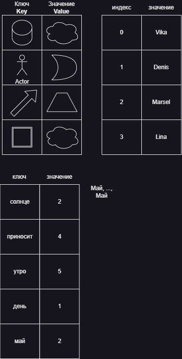

## Ассоциативные массивы

* Ассоциативный массив (словарь, карта, dictionary, map) - это таблица, которая позволяет сопоставить пары различных элементов.
* Каждая пара называется ключом/значением.
* При этом ключи должны быть `уникальными`.
* Мы всегда можем получить какое-либо значение по ключу, например `get('Человек')` получу `Луну`
* Базовые операции ассоциативного массива - это внесение пары `put(key, value)`, получение `get(key)`
* Ключи и значения могут быть произвольных типов

## Ассоциативные массивы в Java

* Концепция ассоциативных массивов в Java реализована в виде интерфейса `Map` и его реализации `HashMap`

```
class HashMap<K,V> implements Map<K,V> {
    // ...
}
```

* В интерфейсе `Map` перечислены базовые операции для работы с `Map`:

`boolean containsKey(Object key);` - проверяет наличие объекта (ключа) среди ключей
`boolean containsValue(Object value);` - проверяет наличие объекта (значения) среди значений
`V get(Object key);` - получает значение V по объекту (ключу)
`V put(K key, V value);` - кладет значение V под ключом K

* В общем и целом Map/HashMap/ассоциативный массив похожи на обычные массивы.
* Обычный массив - это частный случай ассоциативного массива, где ключ (индекс) - целое число

```
String[] names = new String[5];

names[2] = "Marsel"; // ~ namesMap.put(2,"Marsel")
System.out.println(names[2]); // ~ System.out.println(names.get(2));

names[3] = "Vika";
names[3] = "Lina";
```

## Какие задачи мы хотим решить?

* Выяснить, какое слово в тексте встречается чаще других?

